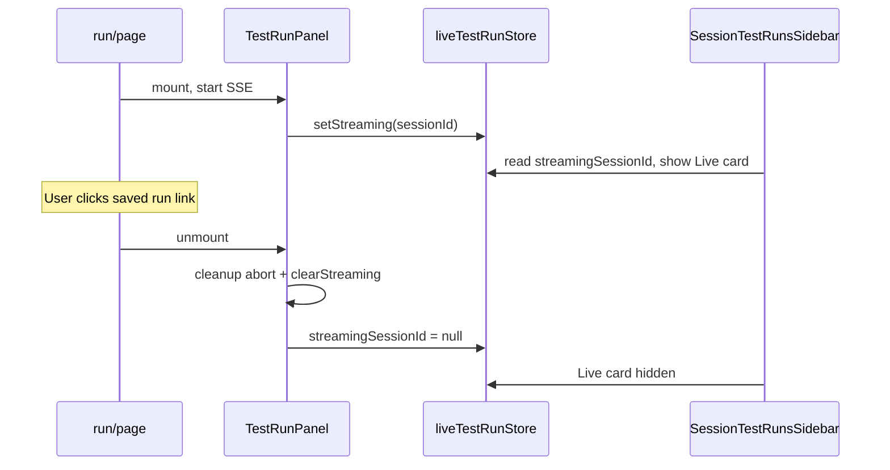

# Test run en sidebar y base de datos (actualizado)

## Comportamiento actual (resumen)

- El historial del sidebar viene de `GET .../attack-test-runs` (solo runs guardados).
- Mientras corre el test, la tarjeta **Live** depende de Zustand (`streamingSessionId`, `lastSavedRunId`), no de la BD.
- La BD se escribe al final del stream cuando el último evento es `run_finished` (`save_completed_run`).

## Bug reportado: al tocar un run guardado mientras otro corre, desaparece el run en curso

### Causa raíz

1. `[TestRunPanel](frontend/components/test-run/TestRunPanel.tsx)` monta solo en `[/sessions/[sessionId]/run/page.tsx](frontend/app/sessions/[sessionId]/run/page.tsx)`.
2. Al navegar al historial (p. ej. enlace a `/sessions/:id/tests?run=...` desde el sidebar), la página `/run` **desmonta** `TestRunPanel`.
3. El `useEffect` de cleanup hace:
  - `ac.abort()` → cancela el `fetch` del SSE (el test deja de ejecutarse en el cliente).
  - `clearStreaming()` → borra `streamingSessionId` y `lastSavedRunId` en `[live-test-run-store](frontend/lib/stores/live-test-run-store.ts)`.
4. `[SessionTestRunsSidebar](frontend/components/test-run/SessionTestRunsSidebar.tsx)` deja de mostrar la tarjeta **Live** porque `streamingSessionId` queda en `null`.

No es un fallo de la lista de la API: es **desmontaje + limpieza agresiva** al salir de `/run`.

### Dirección de arquitectura para corregirlo

Para que el run siga visible (y, si se desea, **siga ejecutándose**) al ir a `/tests`:

1. **No acoplar el ciclo de vida del stream al desmontaje de `TestRunPanel`**
  Subir la ejecución del SSE a un dueño que sobreviva al cambio de ruta dentro del mismo `sessionId`, por ejemplo:
  - un `layout.tsx` bajo `app/sessions/[sessionId]/`, o
  - un módulo/store que mantenga un único `AbortController` por sesión y solo aborte al terminar el run, error explícito, o cambio de sesión.
2. **Separar “limpiar UI del panel” de “cancelar run global”**
  Hoy `clearStreaming()` en unmount borra el estado del sidebar aunque el usuario solo quiera ver otro run guardado.
3. **Criterios de limpieza de Zustand** (definir explícitamente):
  - al recibir `run_saved` + refetch OK (opcional mantener `lastSavedRunId` un momento);
  - al error fatal del stream;
  - al cambiar de `sessionId` activo;
  - opcional: botón “descartar” si se reintroduce cancelación explícita.
4. **Opcional (más trabajo)**: persistir run “en curso” en BD para recuperación tras F5; no es estrictamente necesario para arreglar el bug del sidebar si el stream sigue vivo en segundo plano.

### Archivos implicados en un fix

- `[frontend/components/test-run/TestRunPanel.tsx](frontend/components/test-run/TestRunPanel.tsx)` — hoy posee el stream y el cleanup.
- `[frontend/lib/stores/live-test-run-store.ts](frontend/lib/stores/live-test-run-store.ts)` — cuándo se llama `clearStreaming`.
- Posible nuevo layout o provider en `[frontend/app/sessions/[sessionId]/](frontend/app/sessions/[sessionId]/)` para el dueño del stream.

## Diagrama del bug (navegación run → tests)

